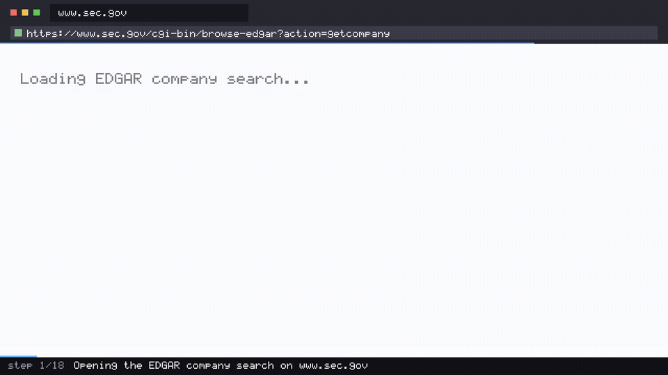

<div align="center">

# 📈 Finance Filing Triage

**An AI agent that opens EDGAR, finds a filer's annual reports, and reports what was filed and when — then films itself doing it.**

[](https://github.com/coasty-ai/coasty-finance-filing-triage/actions/workflows/ci.yml)
[](https://nodejs.org)
[](package.json)
[](#try-it-in-30-seconds)
[](LICENSE)



<sub><b>This is a real capture.</b> Every frame is a screenshot taken by a real browser driving real
software while a vision model read each screen and chose the next action - 7 steps, 7 model calls,
no script and no answer key. Provenance and per-frame hashes in <a href="media/capture.json">media/capture.json</a>.</sub>

</div>

---

- **Zero dependencies.** No `npm install`, no lockfile, no supply chain — pure Node built-ins.
- **Runs offline for $0.** No API key, no account. A bundled in-process mock runs the full agent loop on a fresh clone.
- **The demo video renders itself.** The frames come straight out of the run — against live Coasty they are the model's own input frames, so there is no storyboard that can drift.

## What this is

A complete, runnable [Coasty](https://coasty.ai) computer-use automation for **SEC filing full-text triage**. It gives an AI agent one goal in plain English, and the agent drives a real browser to accomplish it — here, the EDGAR-FTS 3270 filing retrieval terminal — no selectors, no scraping rules, no DOM parsing to maintain.

**Zero dependencies. Runs offline for $0 on a fresh clone. ~$0.90 to run for real.**

```
"You are covering the filings desk on this EDGAR-FTS 3270 retrieval
 terminal. Sign on with user ID FTS042 (any password is accepted in this
 region). From the FTS main menu open the COMPANY FILING INQUIRY function.
 Run an inquiry for ticker HLBN with FORM TYPE set to ALL and the
 filed-date range 2025-01-01 through 2025-12-31, leaving the sort sequence
 as pre-filled. From the result list work out which single submission is
 the LARGEST by SIZE (KB), then display that submission's detail record.
 Report: (1) how many filings the inquiry returned in total, (2) how many
 of the returned filings are 10-Q filings, (3) the largest submission's
 FORM TYPE, ACCESSION NUMBER, FILED date and SIZE (KB), and (4) from the
 submission detail screen its FILE NUMBER, FILM NUMBER, ACCEPTED timestamp
 and DOCUMENTS count. Quote every value exactly as the screens display it."
```

That prompt *is* the automation. When the site redesigns, the prompt still works.

That property is the whole reason to reach for a computer-use agent here. Filing triage — *has this issuer filed yet, what form was it, on what date, under what accession number* — is the unglamorous first step in front of covenant monitoring, comparables research, KYC refreshes and disclosure surveillance. A scraper does it by encoding one team's reading of one page's markup, and then quietly returns the wrong row the day that markup changes. This automation encodes the **question** instead: find the filer, look at the annual reports, tell me the count, the form type, the date and the accession number. A human analyst given that sentence copes with a redesigned page without being retrained, and so does the agent.

The same prompt style transfers to the parts of this workflow where scraping is not an option at all — regulator portals, exchange notice boards and investor-relations sites that publish to humans and expose no API to anyone.

## Try it in 30 seconds

No API key. No account. No install. No spend.

```bash
git clone https://github.com/coasty-ai/coasty-finance-filing-triage
cd coasty-finance-filing-triage
npm start
```

That boots a bundled offline mock in-process and runs the whole agent loop against it. Then render the demo video from the run's own frames:

```bash
npm run demo     # needs ffmpeg; writes media/demo.mp4 + demo.gif + poster.jpg
```

Check your setup any time with `npm run doctor`.

## Run it for real

**1. Get a Coasty API key** — create one at **<https://coasty.ai/developers/keys>**.
The raw key is shown *once*, at creation, so save it when it appears.
A `sk-coasty-test-…` **sandbox** key never bills and is enough to try this;
a `sk-coasty-live-…` key bills your wallet. A new key already carries the
`runs:read` and `runs:write` scopes this automation needs, so there is
nothing extra to enable.

**2. Give both consents, then run:**

```bash
export COASTY_API_KEY=sk-coasty-test-...      # from the link above
export COASTY_BASE_URL=https://coasty.ai/v1
export COASTY_ALLOW_LIVE=1                     # destination consent
npm start -- --live --confirm-cost-cents 120   # cost consent
```

Both consents are required and they are deliberately separate. A live key alone will not spend; a base URL alone will not spend. See [Safety](#safety).

| | |
|---|---|
| Expected cost | **90¢** (18 steps × 5 credits) |
| Worst case | **120¢** (24-step cap) |
| Model-input frames | **free** |
| Machine runtime | Coasty provisions and destroys its own VM |

`npm run estimate` prints this before anything runs.

EDGAR is a public system and this automation reads it the way a member of the public does: no key, no login, no cookie. It stays on the first page of results by instruction, so one run is one filer and a bounded amount of reading.

## What the agent actually did

It was given the prompt above and nothing else - no selectors, no coordinates, no answer key -
then operated **EDGAR-FTS 3270 filing retrieval terminal** through a real browser:

```
software    EDGAR-FTS 3270 filing retrieval terminal
model       gpt-5.2
steps       7 (each = one screenshot, one decision, one action)
cost        ~$0.027
captured    2026-08-02
```

What it reported, read off the screen:

```
  (1) Total filings returned: "012 HITS"
  (2) Number of 10-Q filings: "10-Q=3"
  (3) Largest submission (by SIZE (KB)):
  - FORM TYPE: "S-1"
```


## Safety

This repo is built so that **accidental spend is structurally impossible**, not merely discouraged:

- **Fail-closed destination.** An unset `COASTY_BASE_URL` resolves to the bundled offline mock. Production is never a default.
- **Two independent consents.** `COASTY_ALLOW_LIVE=1` authorises the *destination*; `--confirm-cost-cents N` authorises the *cost*, and N must equal the server-computed worst case exactly.
- **Idempotency by default.** The submit key is derived from the prompt, so a retried submit returns the original run instead of provisioning a second machine.
- **A hard cap per unit.** A worst case above `capCents` in [`automation.json`](automation.json) is refused before any request is made.
- **No real credentials.** The captured demo signs on to a simulated legacy system with a
  throwaway operator ID that the system itself displays. Nothing here reads a real
  password, token or cookie, and no secret is stored in this repo.

## Project layout

```
automation.json      the entire unit definition — prompt, target, budget, caps
src/client.mjs       Coasty client: fail-closed target, retry, idempotency
src/capture.mjs      model-input frames → mp4/gif/poster, with sanity checks
src/cli.mjs          run · demo · estimate
tools/mock.mjs       the bundled offline Coasty (real 1280×720 PNG frames)
tools/doctor.mjs     preflight
test/                36 tests, zero dependencies, fully offline
```

Adding a new automation is one `automation.json` and one prompt — `src/` never forks. See [AGENTS.md](AGENTS.md) for the authoring contract used by Claude Code and Codex.

## Tests

```bash
npm test     # node --test, no install, no network, no key
```

## Related

Part of the **Coasty automation catalog** — computer-use automations across 12 industries. See [the index](https://github.com/coasty-ai) for retail, healthcare, legal, logistics, energy, public sector, HR, education, manufacturing, nonprofit and e-commerce.

- [Coasty docs](https://coasty.ai/docs) · [API reference](https://coasty.ai/docs/llms.txt)
- [computer-use-cookbook](https://github.com/coasty-ai/computer-use-cookbook) — the API, by endpoint, in 4 languages
- [open-cowork](https://github.com/coasty-ai/open-cowork) — the open-source AI coworker

## License

MIT © Coasty
